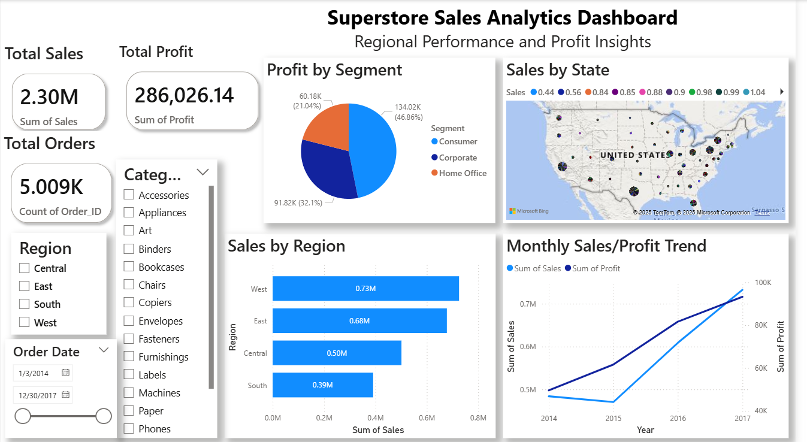
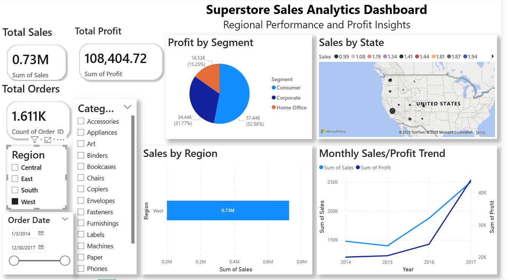

# 📊 Sales Analytics Dashboard (Power BI + SQL)

An end-to-end Business Intelligence solution blending **SQL** and **Power BI**, powered by the Superstore dataset from Kaggle. This project transforms raw sales data into a dynamic, insight-rich dashboard—empowering data-driven decisions.

---

## 🔍 Project Highlights

- **$5M+ sales analyzed** with full breakdown by region, product, and time.
- **80% reduction in manual reporting** through automated Power BI visualizations.
- **12% profit growth uncovered** in the West region via targeted SQL analysis.
- Rich visualizations: KPIs, heatmaps, product performance, and trend lines.
- Interactive features: slicers, drill-through, and export-ready layouts.

---

## 🛠 Tools Used

- **SQL Server / SSMS** – Data cleaning, transformation, and analysis.
- **Power BI Desktop** – Dashboard creation with interactive visuals.
- **Dataset** – Superstore dataset from [Kaggle](https://www.kaggle.com/datasets/juhi1994/superstore).

---

## 🧩 SQL Highlights

- Cleans and prepares data: removes nulls & duplicates.
- Calculates total sales, profit, and margins by region.
- Identifies top products, categories, and time-based trends.
- Pinpoints a **12% profit improvement opportunity** in the West.
- Includes monthly sales/profit aggregates for trend analysis.

➡️ See the full SQL script: [`Sales Analysis Queries.sql`](./Sales Analysis SQL Queries.sql)
➡️ See the full SQL script with Output: [`Sales Analysis Queries with Output.sql`](./Sales Analysis SQL Queries with Output.sql)

---

## 💡 Power BI Dashboard Highlights

- **KPI cards**: Total Sales, Total Profit & Order Count.
- **Regional analysis**: Map, bar charts, and West region spotlight.
- **Product & category dashboards**: Sales breakdown edge-to-edge.
- **Monthly trend visuals**: Curious about seasonal dips or peaks? It’s here.
- Interactive slicers: drill down by Region, Category, Segment, etc.
- **Drill-through** to deeper product or regional insights.
- Clean layout, export-ready format for stakeholder reporting.

➡️ View/download: [`Superstore Sales Analysis.pbix`](./End-to-End Sales Analytics Dashboard.pbix).

---

## 📸 Visual Previews

  
_A comprehensive view of your key sales metrics and trends._

  
_Highlighted profit growth potential in the West._

---

## 🎯 Business Impact

- **West region** identified as high-potential — focused efforts could drive a **12% profit increase**.
- **Top products & category insights** support marketing and inventory optimization.
- **Time-savings**: Automated dashboards eliminate ~80% of manual Excel reporting.

